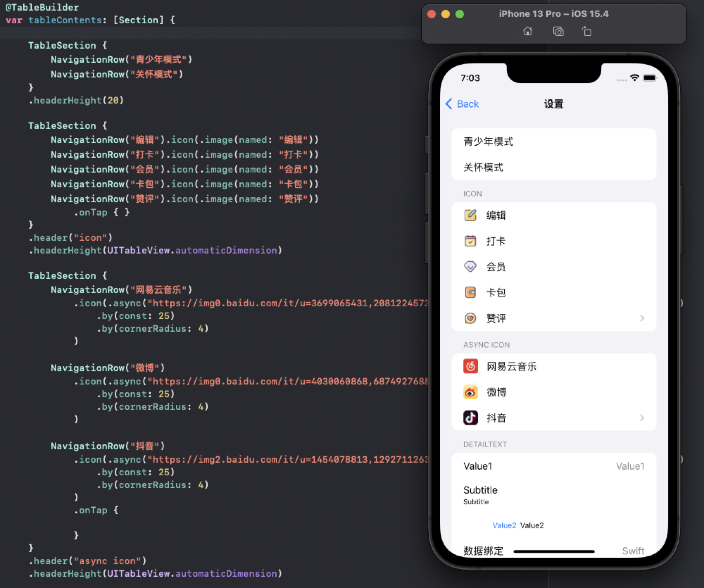
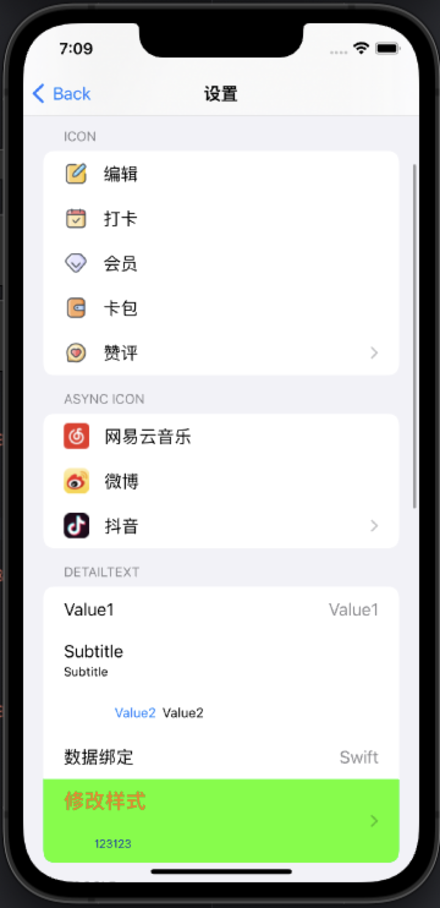
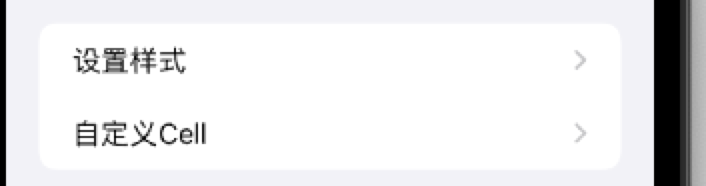
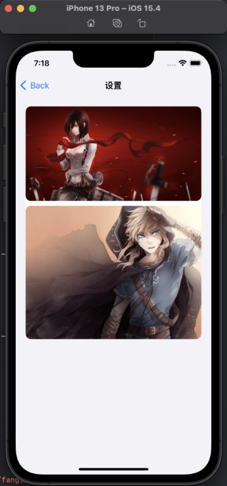
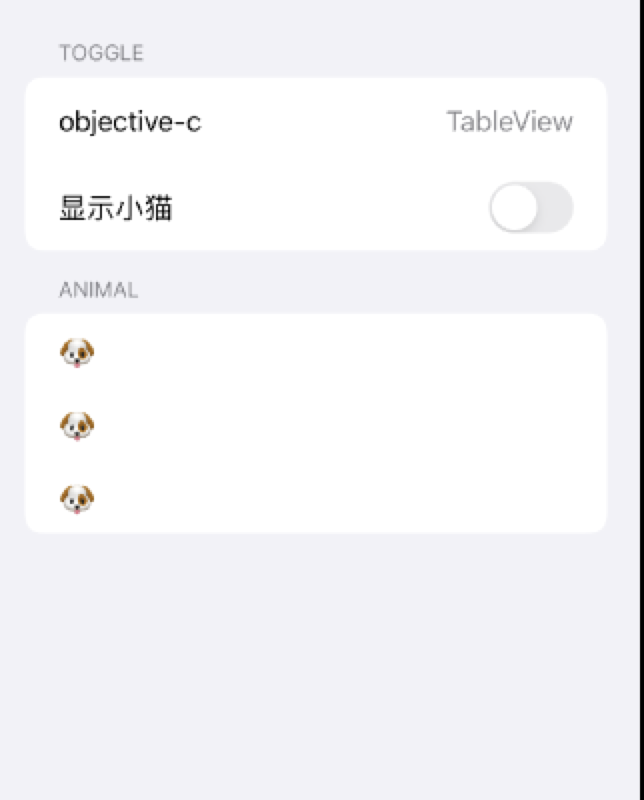
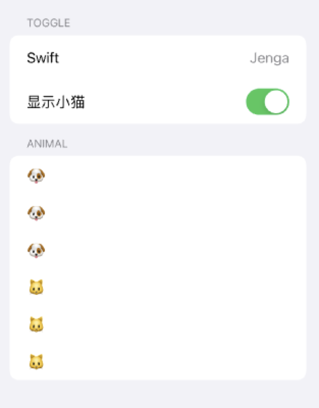
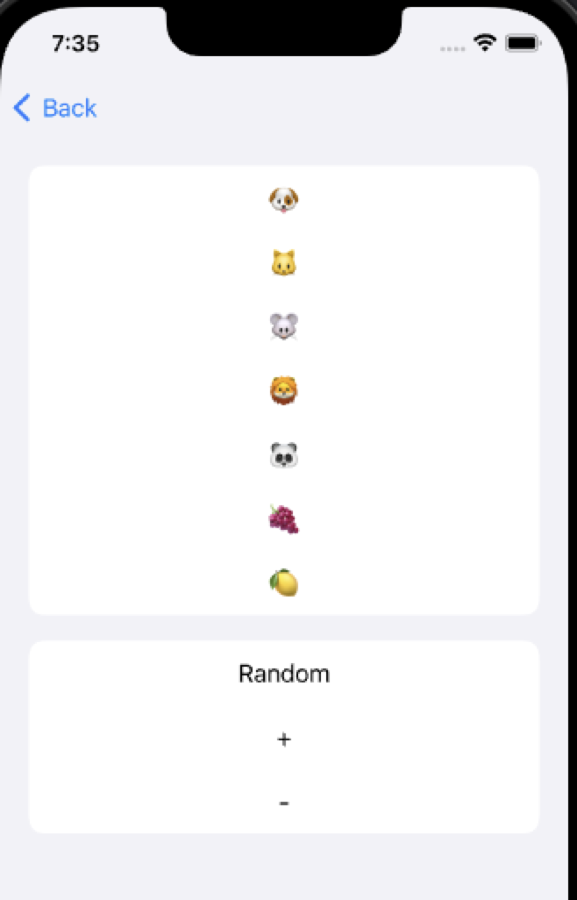

# Jenga - 基于Swift ResultBuilder优雅的构建UITableView

[](LICENSE)&nbsp;
&nbsp;
&nbsp;
[](https://swift.org/package-manager/)&nbsp;
[](https://cocoapods.org)

## 特性

- [x] 使用DSL链式语法构建列表 流畅的编码体验 优雅自然的样式设置.
- [x] 丰富的Cell支持.
- [x] 支持系统设置样式类型
- [x] 支持自定义Cell类型.
- [x] 支持`state`和`binding`
- [x] 支持自动计算行高
- [x] 更多新特性的不断加入.


## 截屏



<div align="center">

</div>

## 安装

#### CocoaPods - Podfile

```ruby
pod 'Jenga'
```

#### [Swift Package Manager for Apple platforms](https://developer.apple.com/documentation/xcode/adding_package_dependencies_to_your_app)

选择 Xcode 菜单 `File > Swift Packages > Add Package Dependency` 输入仓库地址.  
```
Repository: https://github.com/fanglinwei/Jenga
```

#### [Swift Package Manager](https://swift.org/package-manager/)

将以下内容添加到你的 `Package.swift`:
```swift
.package(url: "https://github.com/fanglinwei/Jenga.git", from: "version")
```


## 使用

首先导入

```swift
import Jenga
```


初始化

```swift
JengaProvider.setup()
```


下面是一些简单示例. 支持所有设备和模拟器:


#### 使用`DSLAutoTable`快速构建:

```swift
import Jenga

class ViewController: UIViewController, DSLAutoTable {

    @TableBuilder
    var tableContents: [Section] {
        TableSection {
            
            NavigationRow("设置样式")
                .onTap(on: self) { (self) in
                    self.navigationController?.pushViewController(SettingViewController(), animated: true)
                }

            NavigationRow("自定义Cell")
                .onTap(on: self) { (self) in
                    self.navigationController?.pushViewController(CustomViewController(), animated: true)
                }
        }
    }
}
```

预览

<div align="center">

</div>

#### 自定义Cell:

```swift
@TableBuilder
    var tableContents: [Section] {
        
        TableSection {
            
            TableRow<BannerCell>("image1")
                .height(1184 / 2256 * (UIScreen.main.bounds.width - 32))
                .customize { [weak self] cell in
                    cell.delegate = self
                }
            
            SpacerRow(10)
            
            TableRow<BannerCell>()
                .height(1540 / 2078 * (UIScreen.main.bounds.width - 32))
                .data("image2")
                .customize { (cell, value) in
                    print(cell, value)
                }
        }
        .headerHeight(20)
    }
```

预览

<div align="center">

</div>


#### 状态以及绑定:

```swift
    @State var text = "objective-c"
    
    @State var detailText = "TableView"
    
    @State var isHiddenCat = false

    // DSL
    @TableBuilder
    var tableContents: [Section] {
        
        TableSection {
            NavigationRow($text)
                .detailText($detailText)
            
            ToggleRow("显示小猫", isOn: $isHiddenCat)
                .onTap(on: self) { (self, isOn) in
                    self.isHiddenCat = isOn
                }
            
        }
        .header("Toggle")
        .rowHeight(52)
        .headerHeight(UITableView.automaticDimension)
        
        TableSection(binding: $isHiddenCat) { isOn in
            NavigationRow("🐶")
            NavigationRow("🐶")
            NavigationRow("🐶")
  
            if isOn {
                NavigationRow("🐱")
                NavigationRow("🐱")
                NavigationRow("🐱")
            }
        }
        .header("Animal")
        .headerHeight(UITableView.automaticDimension)
    }
```

更改状态

```swift
text = "Swift"
detailText = "Jenga"
isShowCat = true
```


预览

<div align="center">


</div>

#### Section Binding: 

```swift
    @State var emojis: [String] = ["🐶", "🐱", "🐭", "🦁", "🐼"]
    
    // DSL
    @TableBuilder
    var tableContents: [Section] {
        
        TableSection(binding: $emojis) {
            TableRow<EmojiCell>()
                .data($0)
                .height(44)
        }
        .headerHeight(UITableView.automaticDimension)
        
        TableSection {
            TapActionRow("Random")
                .onTap(on: self) { (self) in
                    guard self.emojis.count > 3 else { return }
                    self.emojis[2] = randomEmojis[Int.random(in: 0 ... 4)]
                    self.emojis[3] = randomEmojis[Int.random(in: 0 ... 4)]
                }
            
            TapActionRow("+")
                .onTap(on: self) { (self) in
                    self.emojis.append(randomEmojis[Int.random(in: 0 ... 4)])
                }
            
            TapActionRow("-")
                .onTap(on: self) { (self) in
                    guard self.emojis.count > 0 else { return }
                    _ = self.emojis.popLast()
                }
        }
        .headerHeight(UITableView.automaticDimension)
    }
```


预览

<div align="center">

</div>
更多示例请查看工程应用.


如果你想自定义创建的`TableView`

```swift
        JengaProvider.autoTable { frame in
            let tableView: UITableView
            if #available(iOS 13.0, *) {
                tableView = UITableView(frame: frame, style: .insetGrouped)
            } else {
                tableView = UITableView(frame: frame, style: .grouped)
            }
            tableView.separatorStyle = .none
            return tableView
        }
```


如果你不想使用`DSLAutoTable`和`DSLTable`协议

1. ###### 创建 TableDirector

   ```swift
   lazy var table = TableDirector(tableView, delegate: self
   ```

2. ###### 使用TableBuilder描述Contents

   ```swift
       @TableBuilder
       var tableContents: [Section] {
           
           TableSection(binding: $array) {
               TableRow<EmojiCell>()
                   .data($0)
                   .height(44)
           }
           .headerHeight(UITableView.automaticDimension)
       }
   ```

3. ###### 刷新数据

   ```swift
   table.set(sections: tableContents)
   ```

好了 你的列表完成了

## `RowSystem`的协议提供链式

| Row                     | 描述               |
| :---------------------- | ------------------ |
| `text`                  | 标题               |
| `detailText`            | 子标题(默认value1) |
| `detailText(.subtitle)` | 子标题subtitle     |
| `detailText(.value1)`   | 子标题value1       |
| `detailText(.value2)`   | 子标题value2       |
| `detailText(.none)`     | 子标题空样式       |
| `isOn`                  | 开关               |
| `height`                | 行高               |
| `estimatedHeight`       | 预估行高               |
| `selectionStyle`        | 选中样式               |
| `onTap`                 | 点击事件              |
| `customize`             | 自定义              |


## 贡献

如果您需要实现特定功能或遇到错误，请打开issue。
如果您自己扩展了Jenga的功能并希望其他人也使用它，请提交拉取请求。

## 借鉴思路来源
- [LazyFish](https://github.com/zjam9333/LazyFish)
- [QuickTableViewController](https://github.com/bcylin/QuickTableViewController)
- [TableKit](https://github.com/maxsokolov/TableKit)

## 协议

Jenga 使用 MIT 协议. 有关更多信息，请参阅[LICENSE](LICENSE)文件.

